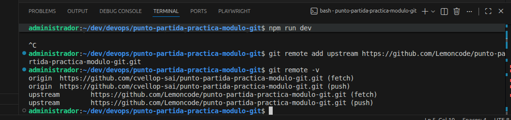
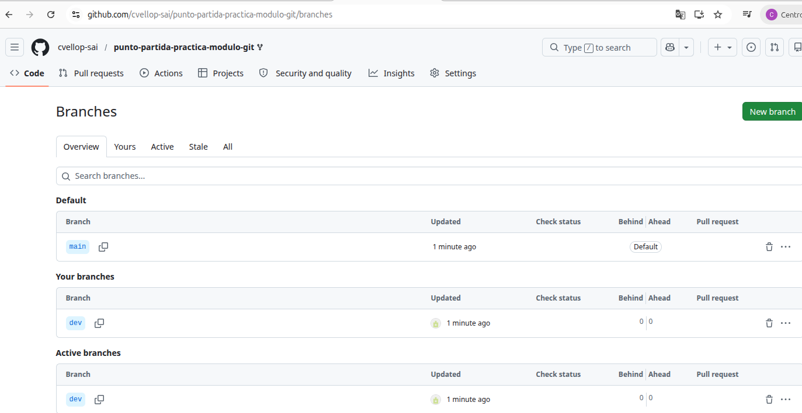

#Tarea 1:
    1. Fork: desde Github...
    2. Clonar: git clone...
    3. npm install ; npm run dev ; visitar http://localhost:5173
    4. git remote add upstream ...
    5. git switch -c dev
    
    