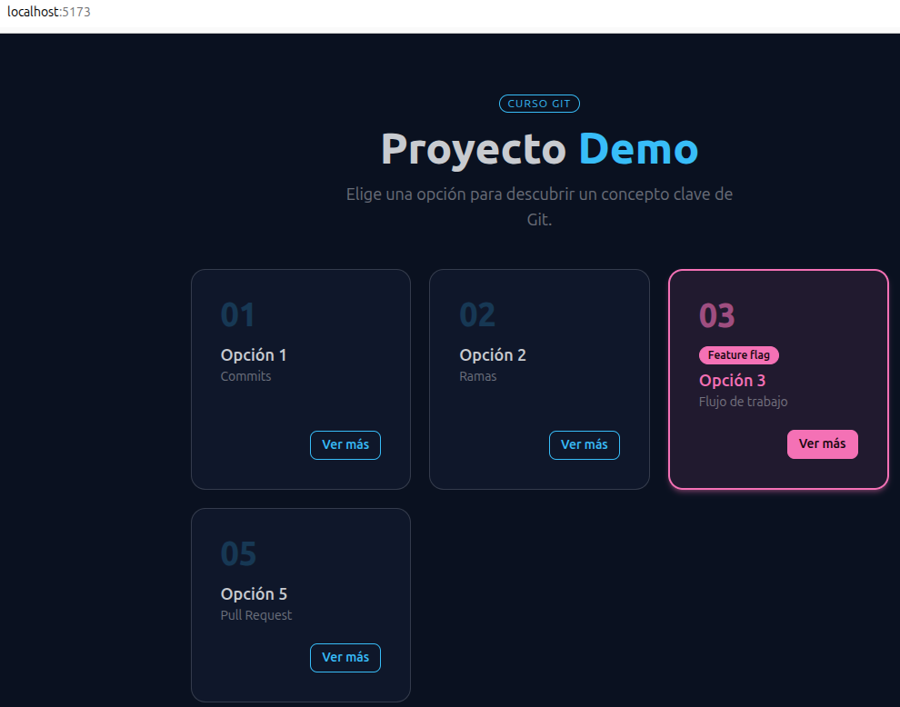
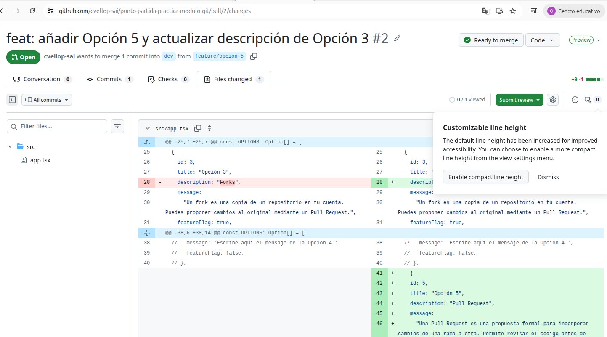
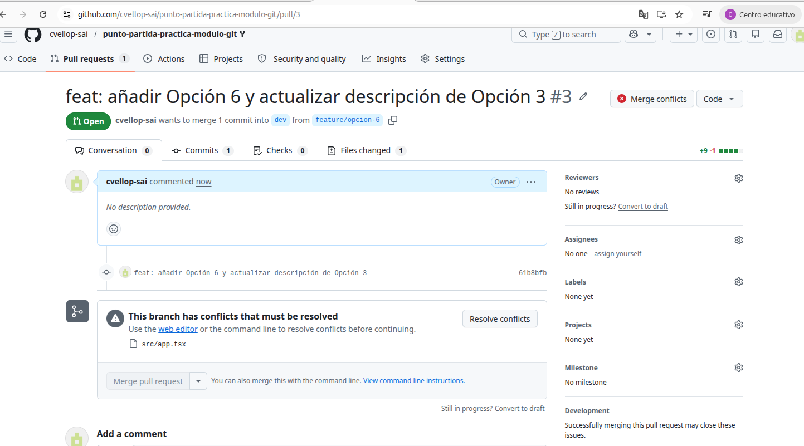
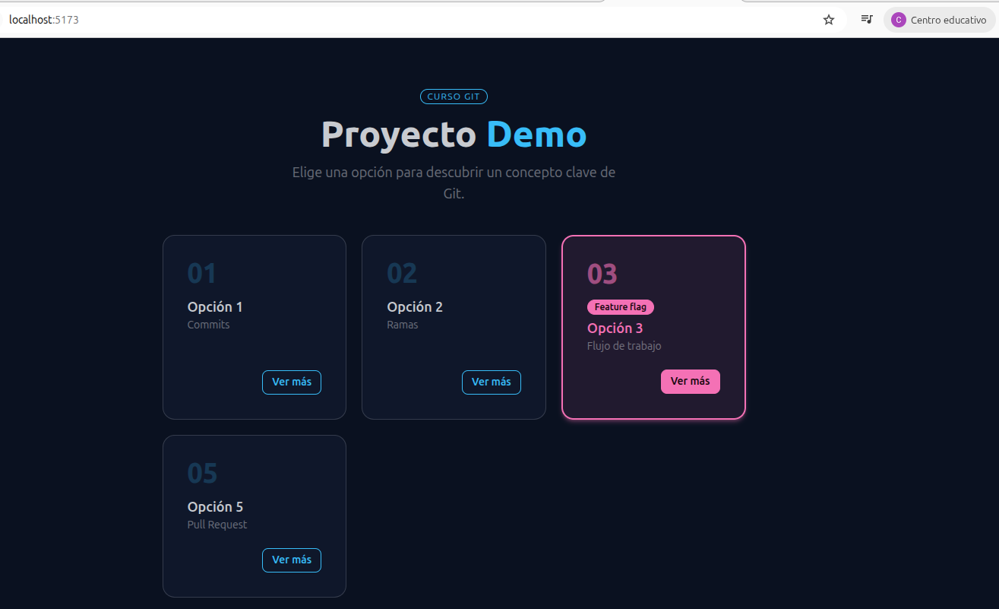
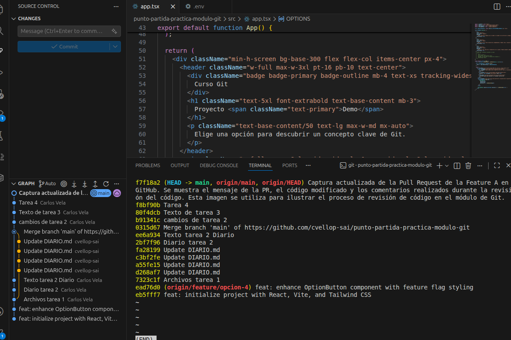

# Tarea 1:
1. Fork: desde Github...
2. Clonar: git clone...
3. npm install ; npm run dev ; visitar http://localhost:5173
4. git remote add upstream ...
5. git switch -c dev
## Fork:
Realiza una copia de un repositorio para tener acceso "privado" para trabajar.
## Upstream:
Sirve para poder subir (push) o descargar (fetch) código a un repositorio diferente al remoto. Generalmente al que se hizo fork.

## Captura 1: git remote -v

## Captura 2: dev branch

# Tarea 2:
La rama parte de dev para que todas las modificaciones en posibles ramas diferentes se puedan unificar (merge) en esa rama principal de nuestra modificación que es dev.

## Captura 3: opción 5

# Tarea 3:
El conflicto es cuando modificaciones de un archivo en ramas diferentes, afectan al mismo fragmento de código (una linea al menos), y cuando se quieren fusionar no se sabe cuál es la modificación correcta. 

Aquí se ha modificado la descripción de la opción 3 en dos ramas diferentes, por lo que no se sabrá de forma automática qué descripción es la definitiva.

# Tarea 4:
Se ha modificado la línea 28 de description de Opción 3.

En la línea 41 se ha añadido nuevo código de la opción 5.
## Captura 4: PR A

# Tarea 5:

Los marcadores <<<<<<<, ======= y >>>>>>> indican las líneas de código contiguas que tienen modificaciones en ambos archivos. Mantuve la opción con el texto que me pareció más razonable.

## Captura 5: PR B

## Captura 6: Marcadores de conflictos

## Captura 7: App con confilctos resueltos

# Tarea 6:
## Captura 8: GIT log --oneline

